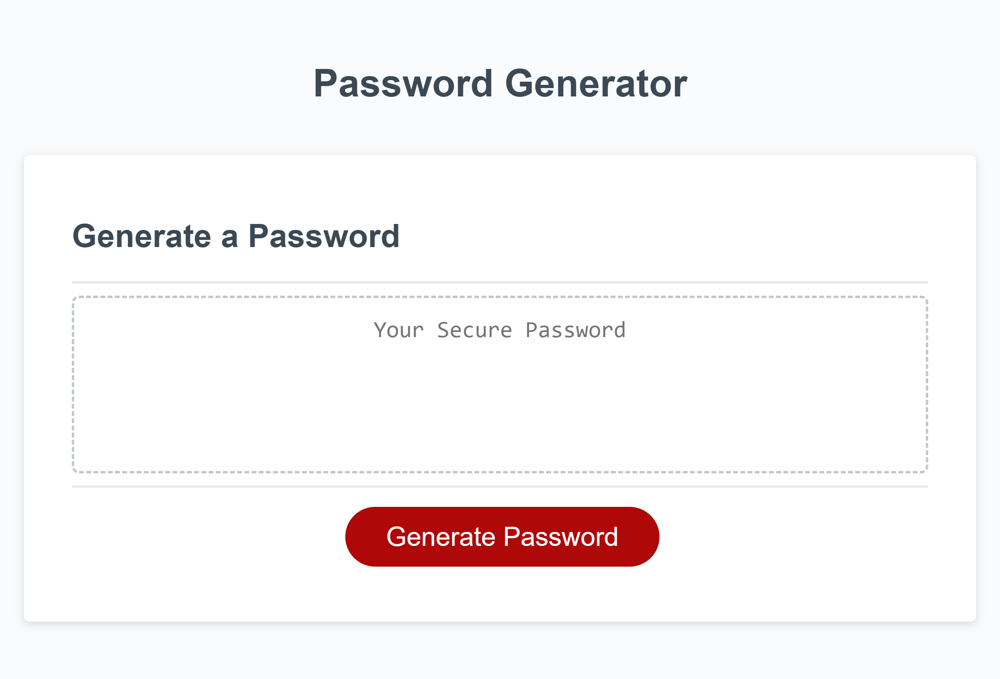

# Javascript-Password-Generator
[Link to my project](https://sydneyhaynes22.github.io/javascript-password-generator/)

## Table of Contents
- [Description](#description)
- [Visuals](#visuals)

## Description
This project consisted of using starter and creating an application that an employee can use to generate a random password based on criteria they've selected. This app runs in the browser and updates HTML and CSS powered by JavaScript code that I wrote. When creating this I enjoyed learning how to utilize for loops, if statements, and Math.random. The thing I struggled with the most was making the password that generates to follow the character number criteria. 

## Visuals

This image depicts the website deployed. When the page is refreshed a prompt will come up asking for criteria before generating a password.